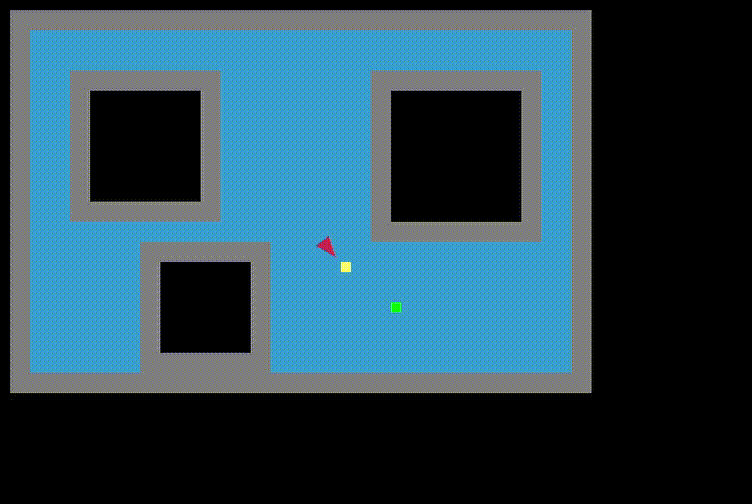

# A_star_algorithm_and_kinematics
My project for studies in the subject: navigation and planning of robot movement. The design task was to model a robot with unicycle kinematics, which finds and moves on a 2D board. It is to provide access to a point set on the map using the A * algorithm. 

See on YouTube: [A star Algorithm with kinematics model](https://www.youtube.com/watch?v=a-k5UlvC_ZY)

